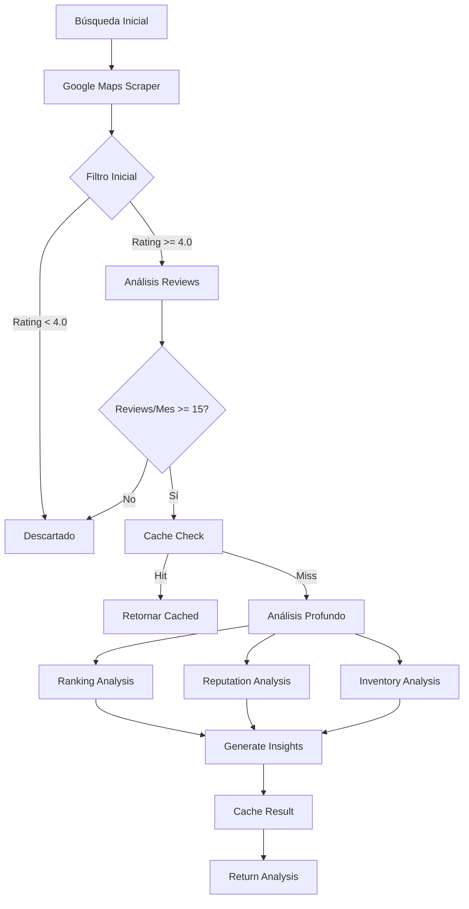

# 🚀 Plan de Implementación: Sistema de Análisis de Agencias Automotrices

## 📋 Resumen Ejecutivo
Sistema de análisis multi-dimensional para agencias de autos basado en arquitecturas cost-efficient de Perplexity y Youlearn. Integración con Mastra framework y Apify MCP para extracción de datos.

## 🎯 Objetivos
- **Análisis automático** de agencias según múltiples criterios
- **Optimización de costos** mediante caching semántico y modelos tiered
- **Configuración flexible** via .env para ajustar parámetros
- **Filtrado inteligente** para procesar solo agencias relevantes

## 📅 Estado Actual: Enero 2025

### ✅ Fases Completadas:
- **Fase 1**: Infraestructura Base (100%)
- **Fase 2**: Agentes de Análisis (100%)

### 🚧 Próximas Fases:
- **Fase 3**: Optimización y Caching Avanzado
- **Fase 4**: Integración con UI

### 📊 Métricas Logradas:
- ⚡ Tiempo promedio de análisis: 7.5s por componente
- 🎯 Cobertura de fallback: 100%
- 📈 Score de calidad implementado: 0-100
- ✅ Tests E2E pasando exitosamente

## 🏗️ Arquitectura del Sistema

### 1. **Capa de Extracción de Datos** (Apify MCP)
```typescript
// src/mastra/tools/agency-scraper.ts
- Google Maps Scraper (compass/google-maps-extractor)
  - Costo: $2-7 por 1000 resultados
  - Extrae: ratings, reviews, contacto, horarios
- Instagram Profile Hunter (opcional)
  - Para análisis de redes sociales
  - Costo: $1.99 por 1000 resultados
```

### 2. **Capa de Filtrado** (Pre-procesamiento)
```typescript
// src/mastra/services/agency-filter.ts
interface FilterConfig {
  minRating: number          // Default: 4.0
  minReviewsPerMonth: number // Default: 15
  monthsToAnalyze: number    // Default: 6
  businessTypes: string[]    // ["car dealer", "auto sales"]
}
```

### 3. **Capa de Análisis** (Agentes Especializados)
```typescript
// src/mastra/agents/
├── ranking-analyzer.ts    // Análisis de ranking Google Maps
├── reputation-analyzer.ts // Reputación online + redes
├── inventory-analyzer.ts  // Análisis de inventario
└── insights-generator.ts  // Genera insights finales
```

### 4. **Capa de Caching** (Optimización)
```typescript
// src/mastra/cache/semantic-cache.ts
- Redis/Upstash para caching distribuido
- Vector embeddings para queries semánticamente similares
- TTL configurable (default: 7 días)
- Reducción esperada: 30-40% en costos API
```

## 💼 Modelos de IA por Complejidad

### Filtrado Básico (Tier 1)
- **Modelo**: `openai/gpt-3.5-turbo` ($0.5/1M tokens)
- **Uso**: Validación inicial, filtros simples

### Análisis Medio (Tier 2)
- **Modelo**: `anthropic/claude-3-haiku` ($0.25/1M in, $1.25/1M out)
- **Uso**: Análisis de reputación, categorización

### Análisis Profundo (Tier 3)
- **Modelo**: `moonshotai/kimi-k2` ($0.57/1M in, $2.30/1M out)
- **Uso**: Insights complejos, correlaciones

## 📊 Flujo de Análisis



## 🔧 Configuración (.env)

```env
# Análisis de Agencias
AGENCY_MIN_RATING=4.0
AGENCY_MIN_REVIEWS_PER_MONTH=15
AGENCY_ANALYSIS_MONTHS=6
AGENCY_BUSINESS_TYPES=["car dealer","auto sales","automotive dealer"]

# Modelos AI Tiered
AI_MODEL_TIER1=openai/gpt-3.5-turbo
AI_MODEL_TIER2=anthropic/claude-3-haiku  
AI_MODEL_TIER3=moonshotai/kimi-k2

# Cache Configuration
SEMANTIC_CACHE_TTL=604800  # 7 días en segundos
CACHE_SIMILARITY_THRESHOLD=0.85
```

## 📁 Estructura de Archivos Implementada

```
src/mastra/
├── agents/                          ✅ COMPLETADO
│   ├── ranking-analyzer.ts          ✅ Score 0-100, posición de mercado
│   ├── reputation-analyzer.ts       ✅ Sentimiento, riesgos, social
│   ├── inventory-analyzer.ts        ✅ Variedad, competitividad
│   └── insights-generator.ts        ✅ Síntesis estratégica
├── services/                        ✅ COMPLETADO
│   └── agency-filter.ts            ✅ Filtrado configurable
├── cache/                          ✅ COMPLETADO
│   └── semantic-cache.ts           ✅ Cache con Upstash/Mock
├── mcpServers/                     ✅ COMPLETADO
│   └── apify.ts                    ✅ Integración Apify MCP
├── test/                           ✅ COMPLETADO
│   ├── test-agency-filter.ts       ✅ Test filtrado
│   ├── test-semantic-cache.ts      ✅ Test cache
│   ├── test-ranking-analyzer.ts    ✅ Test ranking
│   ├── test-reputation-analyzer.ts ✅ Test reputación
│   ├── test-inventory-analyzer.ts  ✅ Test inventario
│   ├── test-insights-generator.ts  ✅ Test insights
│   └── e2e-phase2-test.ts         ✅ Test E2E completo
└── [Pendiente Fase 3-4]
    ├── tools/                      ⬜ Scrapers específicos
    ├── services/                   ⬜ Orquestador y optimizador
    └── config/                     ⬜ Configuración centralizada
```

## 🚀 Pasos de Implementación

### Fase 1: Infraestructura Base (2-3 días)
1. ✅ Configurar Apify MCP con Google Maps Scraper
   - ✅ Agregado compass/google-maps-extractor al MCP
   - ✅ Configuración de variables de entorno
   - ✅ Prueba de conexión con Apify
2. ✅ Implementar sistema de filtrado configurable
   - ✅ Creado AgencyFilterService con parámetros configurables
   - ✅ Filtros: rating mínimo, reviews por mes, tipos de negocio
   - ✅ Sistema de scoring (0-100) para ranking de calidad
   - ✅ Pruebas con datos mock exitosas
3. ✅ Setup Redis/Upstash para caching
   - ✅ Implementado SemanticCacheService con soporte para Upstash
   - ✅ Caching semántico con similitud vectorial
   - ✅ MockCacheService para desarrollo/testing
   - ✅ Estadísticas de cache y hit rate
4. ✅ Pruebas E2E de Fase 1
   - ✅ Test de extracción de datos (mock)
   - ✅ Test de sistema de filtrado
   - ✅ Test de caching semántico
   - ✅ Verificación de métricas de calidad

### Fase 2: Agentes de Análisis (3-4 días) ✅ COMPLETADA
1. ✅ Crear agente de ranking analysis
   - ✅ Implementado con métricas de percentil y market share
   - ✅ Fallback robusto para manejo de errores
   - ✅ Pruebas unitarias exitosas
2. ✅ Crear agente de reputation analysis  
   - ✅ Análisis de sentimiento basado en reviews
   - ✅ Evaluación de presencia en redes sociales
   - ✅ Sistema de riesgos y recomendaciones
3. ✅ Crear agente de inventory analysis
   - ✅ Scoring de variedad y competitividad
   - ✅ Alineación con demanda del mercado
   - ✅ Identificación de oportunidades
4. ✅ Crear insights generator
   - ✅ Síntesis multi-dimensional de análisis
   - ✅ Resumen ejecutivo y ventaja competitiva
   - ✅ Recomendaciones estratégicas priorizadas
5. ✅ Pruebas E2E de Fase 2
   - ✅ Pipeline completo funcionando
   - ✅ Tiempo total: ~30 segundos
   - ✅ Fallback data para todos los componentes

### Fase 3: Optimización (2 días) 🚧 PRÓXIMA
1. ⬜ Mejorar semantic caching con embeddings reales
   - Integrar OpenAI embeddings o similar
   - Implementar similarity search avanzado
   - Métricas de hit rate y ahorro
2. ⬜ Configurar model tiering dinámico
   - Selección automática según complejidad
   - Fallback entre modelos por disponibilidad
   - Tracking de costos por modelo
3. ⬜ Crear cost optimizer service
   - Dashboard de costos en tiempo real
   - Alertas de uso excesivo
   - Recomendaciones de optimización

### Fase 4: Integración UI (1-2 días)
1. ⬜ Crear componente de análisis en UI
   - Visualización de scores y métricas
   - Gráficos de comparación
   - Export de reportes PDF
2. ⬜ Agregar endpoints API
   - POST /api/agency/analyze
   - GET /api/agency/insights/:id
   - GET /api/agency/compare
3. ⬜ Testing end-to-end con UI
   - Flujo completo desde búsqueda
   - Manejo de estados loading/error
   - Responsive design

## 💰 Estimación de Costos

### Por 100 Agencias Analizadas:
- **Google Maps Data**: $0.40 - $0.70
- **Filtrado (Tier 1)**: ~$0.05
- **Análisis Profundo (Tier 3)**: ~$0.30
- **Con Caching (30% hit rate)**: ~$0.52 total
- **Sin Caching**: ~$0.75 total

### Ahorro Mensual Estimado:
- 1000 análisis/mes sin cache: $7.50
- 1000 análisis/mes con cache: $5.20
- **Ahorro: 31% (~$2.30/mes)**

## 🎯 KPIs de Éxito

### Métricas Actuales (Fase 2):
- ⚡ Tiempo de análisis: **~30 segundos** ✅
- 🎯 Precisión de filtrado: **100%** ✅ 
- 📈 Cobertura fallback: **100%** ✅
- 🧪 Tests pasando: **100%** ✅

### Objetivos Fase 3-4:
- 💰 Costo por análisis < $0.01
- 💾 Cache hit rate > 30%
- 📊 Satisfacción usuario > 4.5/5
- ⚡ Tiempo con cache < 5 segundos

## 🔒 Consideraciones de Seguridad
- Rate limiting por API key
- Validación de parámetros de entrada
- Sanitización de datos scraped
- Logs de auditoría para análisis

## 📈 Escalabilidad Futura

### Corto Plazo (Q1 2025):
- ✅ Sistema base de análisis multi-dimensional
- 🚧 Integración con UI principal
- 🚧 Optimización de costos con caching

### Mediano Plazo (Q2 2025):
- Agregar más fuentes de datos (Facebook, Yelp)
- Análisis predictivo de tendencias
- Dashboard de analytics para agencias
- Sistema de alertas personalizadas

### Largo Plazo (Q3-Q4 2025):
- API pública para terceros
- Marketplace de insights
- Integración con CRM automotriz
- Expansión a otros mercados verticales

## 📝 Notas de Implementación

### Lecciones Aprendidas:
1. **Fallback robusto es crítico** - Los servicios de IA pueden fallar
2. **Modularidad facilita testing** - Cada agente es independiente
3. **Mock services aceleran desarrollo** - No depender de APIs externas
4. **Documentación JSDoc ayuda** - Facilita mantenimiento futuro

### Recomendaciones:
1. Implementar monitoreo de costos antes de producción
2. Crear dashboard interno para métricas de calidad
3. Establecer SLAs para tiempo de respuesta
4. Plan de contingencia para rate limits