# 🚀 Plan de Implementación: Sistema de Análisis de Agencias Automotrices

## 📋 Resumen Ejecutivo
Sistema de análisis multi-dimensional para agencias de autos basado en arquitecturas cost-efficient de Perplexity y Youlearn. Integración con Mastra framework y Apify MCP para extracción de datos.

## 🎯 Objetivos
- **Análisis automático** de agencias según múltiples criterios
- **Optimización de costos** mediante caching semántico y modelos tiered
- **Configuración flexible** via .env para ajustar parámetros
- **Filtrado inteligente** para procesar solo agencias relevantes

## 🏗️ Arquitectura del Sistema

### 1. **Capa de Extracción de Datos** (Apify MCP)
```typescript
// src/mastra/tools/agency-scraper.ts
- Google Maps Scraper (compass/google-maps-extractor)
  - Costo: $2-7 por 1000 resultados
  - Extrae: ratings, reviews, contacto, horarios
- Instagram Profile Hunter (opcional)
  - Para análisis de redes sociales
  - Costo: $1.99 por 1000 resultados
```

### 2. **Capa de Filtrado** (Pre-procesamiento)
```typescript
// src/mastra/services/agency-filter.ts
interface FilterConfig {
  minRating: number          // Default: 4.0
  minReviewsPerMonth: number // Default: 15
  monthsToAnalyze: number    // Default: 6
  businessTypes: string[]    // ["car dealer", "auto sales"]
}
```

### 3. **Capa de Análisis** (Agentes Especializados)
```typescript
// src/mastra/agents/
├── ranking-analyzer.ts    // Análisis de ranking Google Maps
├── reputation-analyzer.ts // Reputación online + redes
├── inventory-analyzer.ts  // Análisis de inventario
└── insights-generator.ts  // Genera insights finales
```

### 4. **Capa de Caching** (Optimización)
```typescript
// src/mastra/cache/semantic-cache.ts
- Redis/Upstash para caching distribuido
- Vector embeddings para queries semánticamente similares
- TTL configurable (default: 7 días)
- Reducción esperada: 30-40% en costos API
```

## 💼 Modelos de IA por Complejidad

### Filtrado Básico (Tier 1)
- **Modelo**: `openai/gpt-3.5-turbo` ($0.5/1M tokens)
- **Uso**: Validación inicial, filtros simples

### Análisis Medio (Tier 2)
- **Modelo**: `anthropic/claude-3-haiku` ($0.25/1M in, $1.25/1M out)
- **Uso**: Análisis de reputación, categorización

### Análisis Profundo (Tier 3)
- **Modelo**: `moonshotai/kimi-k2` ($0.57/1M in, $2.30/1M out)
- **Uso**: Insights complejos, correlaciones

## 📊 Flujo de Análisis

```mermaid
graph TD
    A[Búsqueda Inicial] --> B[Google Maps Scraper]
    B --> C{Filtro Inicial}
    C -->|Rating < 4.0| D[Descartado]
    C -->|Rating >= 4.0| E[Análisis Reviews]
    E --> F{Reviews/Mes >= 15?}
    F -->|No| D
    F -->|Sí| G[Cache Check]
    G -->|Hit| H[Retornar Cached]
    G -->|Miss| I[Análisis Profundo]
    I --> J[Ranking Analysis]
    I --> K[Reputation Analysis]
    I --> L[Inventory Analysis]
    J & K & L --> M[Generate Insights]
    M --> N[Cache Result]
    N --> O[Return Analysis]
```



## 🔧 Configuración (.env)

```env
# Análisis de Agencias
AGENCY_MIN_RATING=4.0
AGENCY_MIN_REVIEWS_PER_MONTH=15
AGENCY_ANALYSIS_MONTHS=6
AGENCY_BUSINESS_TYPES=["car dealer","auto sales","automotive dealer"]

# Modelos AI Tiered
AI_MODEL_TIER1=openai/gpt-3.5-turbo
AI_MODEL_TIER2=anthropic/claude-3-haiku  
AI_MODEL_TIER3=moonshotai/kimi-k2

# Cache Configuration
SEMANTIC_CACHE_TTL=604800  # 7 días en segundos
CACHE_SIMILARITY_THRESHOLD=0.85
```

## 📁 Estructura de Archivos

```
src/mastra/
├── agents/
│   ├── ranking-analyzer.ts
│   ├── reputation-analyzer.ts
│   ├── inventory-analyzer.ts
│   └── insights-generator.ts
├── tools/
│   ├── google-maps-scraper.ts
│   └── social-media-scraper.ts
├── services/
│   ├── agency-filter.ts
│   ├── analysis-orchestrator.ts
│   └── cost-optimizer.ts
├── cache/
│   ├── semantic-cache.ts
│   └── embeddings-manager.ts
└── config/
    └── analysis-config.ts
```

## 🚀 Pasos de Implementación

### Fase 1: Infraestructura Base (2-3 días)
1. ✅ Configurar Apify MCP con Google Maps Scraper
   - ✅ Agregado compass/google-maps-extractor al MCP
   - ✅ Configuración de variables de entorno
   - ✅ Prueba de conexión con Apify
2. ✅ Implementar sistema de filtrado configurable
   - ✅ Creado AgencyFilterService con parámetros configurables
   - ✅ Filtros: rating mínimo, reviews por mes, tipos de negocio
   - ✅ Sistema de scoring (0-100) para ranking de calidad
   - ✅ Pruebas con datos mock exitosas
3. ✅ Setup Redis/Upstash para caching
   - ✅ Implementado SemanticCacheService con soporte para Upstash
   - ✅ Caching semántico con similitud vectorial
   - ✅ MockCacheService para desarrollo/testing
   - ✅ Estadísticas de cache y hit rate
4. ✅ Pruebas E2E de Fase 1
   - ✅ Test de extracción de datos (mock)
   - ✅ Test de sistema de filtrado
   - ✅ Test de caching semántico
   - ✅ Verificación de métricas de calidad

### Fase 2: Agentes de Análisis (3-4 días)
1. 🔄 Crear agente de ranking analysis
2. ⬜ Crear agente de reputation analysis
3. ⬜ Crear agente de inventory analysis
4. ⬜ Crear insights generator

### Fase 3: Optimización (2 días)
1. ⬜ Implementar semantic caching
2. ⬜ Configurar model tiering
3. ⬜ Crear cost optimizer service

### Fase 4: Integración (1-2 días)
1. ⬜ Integrar con UI existente
2. ⬜ Agregar endpoints API
3. ⬜ Testing end-to-end

## 💰 Estimación de Costos

### Por 100 Agencias Analizadas:
- **Google Maps Data**: $0.40 - $0.70
- **Filtrado (Tier 1)**: ~$0.05
- **Análisis Profundo (Tier 3)**: ~$0.30
- **Con Caching (30% hit rate)**: ~$0.52 total
- **Sin Caching**: ~$0.75 total

### Ahorro Mensual Estimado:
- 1000 análisis/mes sin cache: $7.50
- 1000 análisis/mes con cache: $5.20
- **Ahorro: 31% (~$2.30/mes)**

## 🎯 KPIs de Éxito
- ⚡ Tiempo de análisis < 30 segundos
- 💰 Costo por análisis < $0.01
- 🎯 Precisión de filtrado > 95%
- 💾 Cache hit rate > 30%
- 📊 Satisfacción usuario > 4.5/5

## 🔒 Consideraciones de Seguridad
- Rate limiting por API key
- Validación de parámetros de entrada
- Sanitización de datos scraped
- Logs de auditoría para análisis

## 📈 Escalabilidad Futura
- Agregar más fuentes de datos (Facebook, Yelp)
- Análisis predictivo de tendencias
- Alertas automáticas de cambios
- API pública para terceros