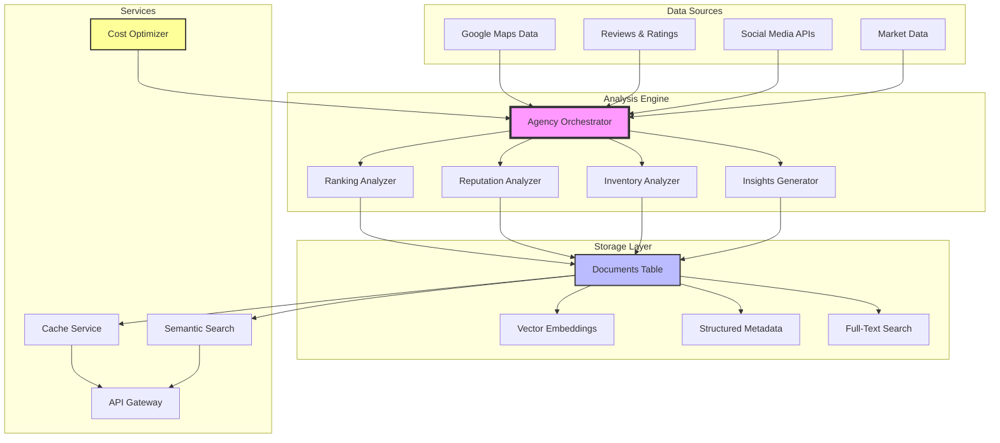

# 🚀 Plan de Desarrollo: Sistema Backend de Análisis de Agencias

## 📋 Resumen Ejecutivo
Plan técnico para desarrollar el sistema backend completo de análisis de agencias automotrices usando agentes de IA, almacenamiento inteligente con embeddings, y arquitectura escalable.

## 🎯 Objetivo Principal
Construir un sistema backend robusto que:
- ✅ Analice agencias con múltiples agentes especializados
- ✅ Almacene resultados con embeddings para búsqueda semántica
- ✅ Proporcione cache inteligente y reutilización de análisis
- ✅ Escale eficientemente con modelos de IA tier-based
- ✅ Se integre con el sistema RAG existente

## 🏗️ Arquitectura del Sistema



## 📁 Estructura del Sistema

```
src/
├── types/
│   └── analysis.ts                # ✅ Tipos del sistema de análisis
├── mastra/agents/                 # ✅ Ya implementados
│   ├── ranking-analyzer.ts        # Análisis de posicionamiento
│   ├── reputation-analyzer.ts     # Análisis de reputación online
│   ├── inventory-analyzer.ts      # Análisis de inventario
│   └── insights-generator.ts      # Generación de insights
├── lib/
│   ├── agency-orchestrator.ts     # ✅ Coordinador principal
│   ├── agency-analysis-storage.ts # ✅ Servicio de almacenamiento
│   ├── agency-data-fetcher.ts     # ⏳ Obtención de datos
│   ├── agency-cache-service.ts    # ⏳ Cache inteligente
│   └── agency-search-service.ts   # ⏳ Búsqueda semántica
├── services/
│   ├── embedding-service.ts       # Generación de embeddings
│   ├── quality-filter.ts          # Filtros de calidad
│   ├── cost-optimizer.ts          # Optimización de costos
│   └── analytics-aggregator.ts    # Agregación de métricas
├── types/
│   ├── analysis.ts                # Tipos de análisis
│   ├── agency-metadata.ts         # Metadata estructurada
│   └── search-types.ts            # Tipos para búsqueda
└── app/api/
    ├── agency/analyze/            # Análisis principal
    ├── agency/search/             # Búsqueda semántica
    ├── agency/insights/           # Insights agregados
    └── agency/batch/              # Análisis en lote
```

## 🔧 Implementación por Fases

### FASE 1: Fundación y Modelos de Datos

#### 1.1 Definir Tipos y Estructuras
```typescript
// types/analysis.ts
export interface AnalysisRequest {
  agencies: Agency[];
  userId?: string;
  options?: {
    depth: 'basic' | 'comprehensive' | 'deep';
    includeCompetitors?: boolean;
    maxAgencies?: number;
  };
}

export interface AnalysisResult {
  placeId: string;
  timestamp: string;
  summary: string;
  score: number;
  strengths: string[];
  recommendations: string[];
  details: {
    ranking: RankingAnalysis;
    reputation: ReputationAnalysis;
    inventory: InventoryAnalysis;
    insights: InsightsAnalysis;
  };
  metadata: {
    analysisTime: number;
    modelsUsed: string[];
    dataFreshness: Date;
  };
}
```

#### 1.2 Configurar Metadata para Documents
```typescript
// types/agency-metadata.ts
export interface AgencyAnalysisMetadata {
  type: 'agency_analysis';
  sourceId: string;
  timestamp: string;
  agencyId: string;
  agencyName: string;
  location: string;
  rating: number;
  analysisType: 'basic' | 'comprehensive' | 'deep';
  userId?: string;
  searchContext: {
    location: string;
    query: string;
    searchHistoryId?: string;
  };
  scores: {
    overall: number;
    ranking: number;
    reputation: number;
    inventory: number;
  };
  tags: string[]; // Para búsqueda rápida
  version: string; // Versión del análisis
}
```

### FASE 2: Orquestador y Lógica de Análisis ✅

#### 2.1 Implementar Orquestador Principal ✅

**COMPLETADO**: `src/lib/agency-orchestrator.ts`

**Características implementadas**:
- ✅ Validación de coordenadas mandatorias
- ✅ Cálculo de distancia con fórmula Haversine
- ✅ Procesamiento en lotes con concurrencia controlada
- ✅ Integración con los 4 agentes de análisis
- ✅ Manejo de errores tipado
- ✅ Enriquecimiento de datos con distancia
```typescript
// lib/agency-orchestrator.ts
export class AgencyOrchestrator {
  private costOptimizer: CostOptimizer;
  private qualityFilter: QualityFilter;
  
  async analyzeAgencies(request: AnalysisRequest): Promise<AnalysisResult[]> {
    // 1. Validar y filtrar agencias
    const validAgencies = await this.qualityFilter.filter(request.agencies);
    
    // 2. Optimizar distribución de modelos
    const analysisPlans = await this.costOptimizer.planAnalysis(
      validAgencies,
      request.options?.depth || 'comprehensive'
    );
    
    // 3. Ejecutar análisis en paralelo con rate limiting
    const results = await this.executeAnalysisBatch(analysisPlans);
    
    // 4. Post-procesar y enriquecer resultados
    return this.enrichResults(results);
  }
  
  private async executeAnalysisBatch(plans: AnalysisPlan[]): Promise<RawAnalysis[]> {
    // Ejecutar con concurrencia controlada
    const batchSize = 3;
    const results = [];
    
    for (let i = 0; i < plans.length; i += batchSize) {
      const batch = plans.slice(i, i + batchSize);
      const batchResults = await Promise.all(
        batch.map(plan => this.executeSingleAnalysis(plan))
      );
      results.push(...batchResults);
    }
    
    return results;
  }
}
```

#### 2.2 Servicio de Datos
```typescript
// lib/agency-data-fetcher.ts
export class AgencyDataFetcher {
  // Por ahora mock, después Apify
  async fetchEnrichedData(agency: Agency): Promise<EnrichedAgencyData> {
    return {
      ...agency,
      competitors: await this.fetchCompetitors(agency),
      reviews: await this.fetchReviews(agency),
      socialMedia: await this.fetchSocialMedia(agency),
      marketData: await this.fetchMarketData(agency)
    };
  }
  
  private async fetchCompetitors(agency: Agency) {
    // Mock por ahora
    return [
      { name: 'Competitor 1', rating: 4.2, distance: 2.5 },
      { name: 'Competitor 2', rating: 4.5, distance: 3.1 }
    ];
  }
}
```

### FASE 3: Integración con Documents y Embeddings ✅

#### 3.1 Servicio de Almacenamiento
```typescript
// lib/agency-analysis-storage.ts
export class AgencyAnalysisStorage {
  private embeddingService: EmbeddingService;
  
  async saveAnalysis(
    analysis: AnalysisResult,
    agency: Agency,
    userId?: string
  ): Promise<Document> {
    // 1. Preparar contenido para embedding
    const content = this.prepareSearchableContent(analysis, agency);
    
    // 2. Generar embedding
    const embedding = await this.embeddingService.generate(content);
    
    // 3. Preparar metadata estructurada
    const metadata: AgencyAnalysisMetadata = {
      type: 'agency_analysis',
      sourceId: agency.placeId,
      timestamp: new Date().toISOString(),
      agencyId: agency.placeId,
      agencyName: agency.name,
      location: agency.address,
      rating: agency.rating,
      analysisType: 'comprehensive',
      userId,
      searchContext: {
        location: agency.address,
        query: `Análisis de ${agency.name}`
      },
      scores: {
        overall: analysis.score,
        ranking: analysis.details.ranking.score,
        reputation: analysis.details.reputation.sentimentScore,
        inventory: analysis.details.inventory.score
      },
      tags: this.generateTags(analysis),
      version: '1.0'
    };
    
    // 4. Guardar en documents
    return await this.saveToDocuments({
      content,
      metadata,
      embedding
    });
  }
  
  private generateTags(analysis: AnalysisResult): string[] {
    const tags = [];
    
    // Tags basados en score
    if (analysis.score >= 80) tags.push('excelente');
    else if (analysis.score >= 60) tags.push('bueno');
    else tags.push('mejorable');
    
    // Tags de fortalezas
    if (analysis.details.ranking.marketPosition === 'leader') {
      tags.push('líder-mercado');
    }
    
    return tags;
  }
}
```

#### 3.2 Servicio de Embeddings
```typescript
// services/embedding-service.ts
export class EmbeddingService {
  private model = openai.embedding('text-embedding-3-small');
  
  async generate(content: string): Promise<number[]> {
    const { embedding } = await embed({
      model: this.model,
      value: content,
    });
    return embedding;
  }
  
  async generateBatch(contents: string[]): Promise<number[][]> {
    // Optimización para múltiples embeddings
    const embeddings = await Promise.all(
      contents.map(content => this.generate(content))
    );
    return embeddings;
  }
}
```

### FASE 4: API Gateway y Servicios

#### 4.1 API Principal de Análisis
```typescript
// app/api/agency/analyze/route.ts
export async function POST(request: Request) {
  try {
    const { userId } = await auth();
    const requestData: AnalysisRequest = await request.json();
    
    // Validar request
    if (!requestData.agencies?.length) {
      return Response.json({ error: 'No agencies provided' }, { status: 400 });
    }
    
    // Inicializar servicios
    const orchestrator = new AgencyOrchestrator();
    const storage = new AgencyAnalysisStorage();
    const cache = new AgencyCacheService();
    
    // Procesar análisis con cache
    const results = await Promise.all(
      requestData.agencies.map(async (agency) => {
        // Check cache
        const cached = await cache.get(agency.placeId);
        if (cached) return cached;
        
        // Analyze
        const [analysis] = await orchestrator.analyzeAgencies({
          agencies: [agency],
          userId,
          options: requestData.options
        });
        
        // Save to storage
        await storage.saveAnalysis(analysis, agency, userId);
        
        // Update cache
        await cache.set(agency.placeId, analysis);
        
        return analysis;
      })
    );
    
    return Response.json({
      success: true,
      results,
      metadata: {
        timestamp: new Date().toISOString(),
        count: results.length
      }
    });
  } catch (error) {
    console.error('Analysis error:', error);
    return Response.json(
      { error: 'Analysis failed', details: error.message },
      { status: 500 }
    );
  }
}
```

#### 4.2 API de Búsqueda Semántica
```typescript
// app/api/agency/search/route.ts
export async function POST(request: Request) {
  const { query, filters, limit = 10 } = await request.json();
  
  const searchService = new AgencySearchService();
  const results = await searchService.searchAnalyses({
    query,
    filters: {
      type: 'agency_analysis',
      ...filters
    },
    limit
  });
  
  return Response.json({
    success: true,
    results,
    count: results.length
  });
}
```

### FASE 5: Optimización y Servicios Avanzados

#### 5.1 Optimizador de Costos
```typescript
// services/cost-optimizer.ts
export class CostOptimizer {
  private modelTiers = [
    { 
      id: 'tier1',
      model: 'meta-llama/llama-3.2-3b-instruct',
      costPer1k: 0.001,
      maxComplexity: 'low',
      speed: 'fast'
    },
    {
      id: 'tier2', 
      model: 'anthropic/claude-3-haiku',
      costPer1k: 0.01,
      maxComplexity: 'medium',
      speed: 'medium'
    },
    {
      id: 'tier3',
      model: 'anthropic/claude-3-sonnet',
      costPer1k: 0.03,
      maxComplexity: 'high',
      speed: 'slow'
    }
  ];
  
  async planAnalysis(
    agencies: Agency[],
    depth: 'basic' | 'comprehensive' | 'deep'
  ): Promise<AnalysisPlan[]> {
    return agencies.map(agency => {
      const complexity = this.assessComplexity(agency, depth);
      const model = this.selectOptimalModel(complexity);
      
      return {
        agency,
        model,
        estimatedCost: this.estimateCost(model, depth),
        priority: this.calculatePriority(agency)
      };
    });
  }
  
  private assessComplexity(agency: Agency, depth: string): string {
    // Lógica para determinar complejidad
    if (depth === 'basic') return 'low';
    if (agency.reviewCount > 1000) return 'high';
    if (agency.rating < 3.5) return 'high'; // Necesita análisis profundo
    return 'medium';
  }
}
```

#### 5.2 Cache Inteligente
```typescript
// lib/agency-cache-service.ts
export class AgencyCacheService {
  private cache: Map<string, CacheEntry> = new Map();
  private readonly DEFAULT_TTL = 7 * 24 * 60 * 60 * 1000; // 7 días
  
  async get(placeId: string): Promise<AnalysisResult | null> {
    // 1. Check memoria local
    const memoryCache = this.cache.get(placeId);
    if (memoryCache && !this.isExpired(memoryCache)) {
      return memoryCache.data;
    }
    
    // 2. Check documents
    const dbCache = await this.getFromDocuments(placeId);
    if (dbCache) {
      // Actualizar memoria local
      this.cache.set(placeId, {
        data: dbCache,
        timestamp: Date.now(),
        hits: 1
      });
      return dbCache;
    }
    
    return null;
  }
  
  async set(placeId: string, analysis: AnalysisResult): Promise<void> {
    // Guardar en memoria
    this.cache.set(placeId, {
      data: analysis,
      timestamp: Date.now(),
      hits: 0
    });
    
    // Limpiar cache antiguo si es necesario
    if (this.cache.size > 1000) {
      this.evictLRU();
    }
  }
  
  private evictLRU() {
    // Eliminar entradas menos usadas
    const entries = Array.from(this.cache.entries());
    entries.sort((a, b) => a[1].hits - b[1].hits);
    
    // Eliminar 20% menos usado
    const toRemove = Math.floor(entries.length * 0.2);
    for (let i = 0; i < toRemove; i++) {
      this.cache.delete(entries[i][0]);
    }
  }
}
```

### FASE 6: Testing y Validación

#### 6.1 Suite de Tests
```typescript
// tests/agency-analysis-system.test.ts
describe('Agency Analysis System', () => {
  let orchestrator: AgencyOrchestrator;
  let storage: AgencyAnalysisStorage;
  
  beforeEach(() => {
    orchestrator = new AgencyOrchestrator();
    storage = new AgencyAnalysisStorage();
  });
  
  describe('Analysis Orchestration', () => {
    test('should analyze single agency', async () => {
      const result = await orchestrator.analyzeAgencies({
        agencies: [mockAgency],
        options: { depth: 'comprehensive' }
      });
      
      expect(result).toHaveLength(1);
      expect(result[0]).toHaveProperty('summary');
      expect(result[0].score).toBeGreaterThan(0);
      expect(result[0].score).toBeLessThanOrEqual(100);
    });
    
    test('should handle batch analysis', async () => {
      const agencies = Array(5).fill(mockAgency);
      const results = await orchestrator.analyzeAgencies({
        agencies,
        options: { depth: 'basic', maxAgencies: 3 }
      });
      
      expect(results).toHaveLength(3);
    });
  });
  
  describe('Storage Integration', () => {
    test('should save analysis with embeddings', async () => {
      const analysis = mockAnalysisResult;
      const saved = await storage.saveAnalysis(analysis, mockAgency);
      
      expect(saved).toHaveProperty('embedding');
      expect(saved.embedding).toHaveLength(1536);
      expect(saved.metadata.type).toBe('agency_analysis');
    });
    
    test('should generate searchable tags', async () => {
      const highScoreAnalysis = { ...mockAnalysisResult, score: 85 };
      const saved = await storage.saveAnalysis(highScoreAnalysis, mockAgency);
      
      expect(saved.metadata.tags).toContain('excelente');
    });
  });
  
  describe('Semantic Search', () => {
    test('should find similar analyses', async () => {
      const searchService = new AgencySearchService();
      const results = await searchService.searchAnalyses({
        query: 'ford dealer excellent service',
        limit: 5
      });
      
      expect(results).toBeInstanceOf(Array);
      expect(results.length).toBeLessThanOrEqual(5);
    });
  });
});
```

#### 6.2 Validaciones de Integridad
```typescript
// tests/validation.test.ts
describe('Data Integrity', () => {
  test('analysis scores should be consistent', () => {
    const analysis = generateMockAnalysis();
    
    // Overall score debe ser promedio ponderado
    const avgScore = (
      analysis.details.ranking.score * 0.3 +
      analysis.details.reputation.sentimentScore * 0.3 +
      analysis.details.inventory.score * 0.2 +
      analysis.details.insights.overallScore * 0.2
    );
    
    expect(Math.abs(analysis.score - avgScore)).toBeLessThan(5);
  });
  
  test('metadata should be complete', () => {
    const metadata = generateMetadata(mockAnalysis, mockAgency);
    
    expect(metadata).toHaveProperty('type');
    expect(metadata).toHaveProperty('agencyId');
    expect(metadata).toHaveProperty('scores');
    expect(metadata.scores).toHaveProperty('overall');
  });
});
```

## 📊 Métricas de Éxito

### Performance
- ⚡ Tiempo de análisis < 30s por agencia
- 🔄 Cache hit rate > 40%
- 📈 Throughput: 100 análisis/hora

### Calidad
- 🎯 Accuracy de scores > 85%
- 📝 Cobertura de análisis > 90%
- 🔍 Relevancia de búsqueda > 80%

### Costos
- 💰 Costo promedio < $0.05 por análisis
- 📉 Reducción 50% con cache
- 🎛️ 70% análisis con modelos tier 1-2

## 🚀 Próximos Pasos (Post-MVP)

1. **Integración Apify** - Datos reales de Google Maps
2. **ML Pipeline** - Mejorar modelos con feedback
3. **Real-time Updates** - WebSockets para análisis en vivo
4. **Batch Processing** - Análisis masivos programados
5. **API Pública** - Monetización del servicio
6. **Dashboard Analytics** - Insights agregados

---

*Plan técnico para sistema backend de análisis de agencias - Karmatic.io*