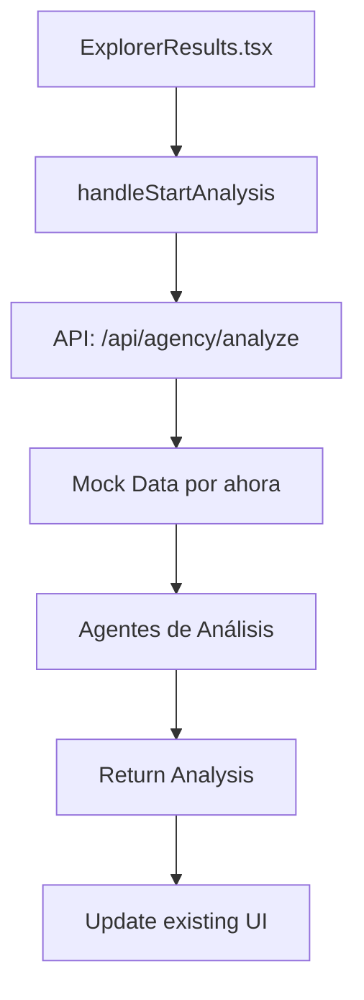

# 🚀 Plan de Integración Frontend (FUTURO)

## 📋 Resumen Ejecutivo
Plan para conectar el sistema backend de análisis (ver `agent-backend-plan.md`) con la UI existente cuando el backend esté completo.

⚠️ **NOTA**: Este plan es para implementación FUTURA. Primero completar el desarrollo del backend según `agent-backend-plan.md`.

## 🎯 Objetivo de Integración Frontend
Conectar el backend completo con la UI usando:
- ✅ El flujo de selección existente (`selectedForAnalysis`)
- ✅ El botón "Analizar" actual (`handleStartAnalysis`)
- ✅ La vista de análisis existente
- ✅ Mínimos cambios en la UI

## 🔗 Dependencias
- Backend completamente implementado (ver fases en `agent-backend-plan.md`)
- API `/api/agency/analyze` funcional
- Sistema de cache y storage operativo

## 🏗️ Arquitectura de Integración Simplificada



## 📁 Archivos Mínimos a Implementar

```
src/
├── app/api/agency/analyze/
│   └── route.ts              # Único endpoint nuevo
├── lib/
│   └── agency-orchestrator.ts # Coordinador de agentes
└── types/
    └── analysis.ts           # Extender types existentes
```

**Cambios en archivos existentes:**
- `ExplorerResults.tsx` - Modificar `handleStartAnalysis` para llamar al API real
- `types/agency.ts` - Extender el tipo `Agency.analysis` con datos reales

## 🔧 Implementación Pragmática

### Fase 1: Backend Mínimo Viable (1 día)

#### 1.1 Orquestador Simplificado (SIN Apify por ahora)
```typescript
// lib/agency-orchestrator.ts
import { analyzeRanking } from '@/mastra/agents/ranking-analyzer';
import { analyzeReputation } from '@/mastra/agents/reputation-analyzer';
import { analyzeInventory } from '@/mastra/agents/inventory-analyzer';
import { generateInsights } from '@/mastra/agents/insights-generator';

export async function analyzeAgencySimple(agency: any) {
  try {
    // Usar datos que YA tenemos del search inicial
    const mockAgencyData = {
      name: agency.name,
      placeId: agency.placeId || 'mock-id',
      rating: agency.rating || 4.0,
      reviewCount: agency.reviewCount || 100,
      type: 'car dealer',
      address: agency.address
    };

    // Mock competitors (por ahora)
    const mockCompetitors = [
      { name: 'Competitor 1', rating: 4.2, reviewCount: 80 },
      { name: 'Competitor 2', rating: 4.5, reviewCount: 120 }
    ];

    // Mock reviews (usar los que ya vienen si existen)
    const mockReviews = agency.recentReviews || [
      { rating: 5, text: 'Excelente servicio', time: '2024-01-01', authorName: 'Usuario' }
    ];

    // Ejecutar análisis con datos disponibles
    const [ranking, reputation, inventory] = await Promise.all([
      analyzeRanking({
        agency: mockAgencyData,
        competitors: mockCompetitors,
        searchContext: { query: 'car dealer', location: agency.address, totalResults: 25 }
      }),
      analyzeReputation({
        agency: mockAgencyData,
        reviews: mockReviews,
        socialMedia: { facebook: { rating: 4.0, reviewCount: 50 } }
      }),
      analyzeInventory({
        agency: mockAgencyData,
        inventory: { totalVehicles: 50 },
        marketData: { averageInventorySize: 60, topSellingCategories: ['SUV'], priceComparison: 'at_market' }
      })
    ]);

    const insights = await generateInsights({
      agency: mockAgencyData,
      rankingAnalysis: ranking,
      reputationAnalysis: reputation,
      inventoryAnalysis: inventory
    });

    // Retornar en formato compatible con UI existente
    return {
      summary: insights.executiveSummary,
      strengths: insights.keyStrengths.map(s => s.insight),
      recommendations: insights.strategicRecommendations.map(r => r.action),
      score: insights.overallScore,
      details: {
        ranking,
        reputation,
        inventory,
        insights
      }
    };
  } catch (error) {
    console.error('Analysis error:', error);
    // Fallback a análisis básico
    return {
      summary: "Análisis con información limitada disponible.",
      strengths: ["Presencia establecida en Google Maps"],
      recommendations: ["Completar información para análisis detallado"],
      score: 50,
      details: null
    };
  }
}
```

#### 1.2 API Endpoint Único
```typescript
// app/api/agency/analyze/route.ts
import { analyzeAgencySimple } from '@/lib/agency-orchestrator';
import { auth } from '@clerk/nextjs/server';

export async function POST(request: Request) {
  try {
    // 1. Auth básico
    const { userId } = await auth();
    
    // 2. Obtener agencias a analizar
    const { agencies } = await request.json();
    if (!agencies || agencies.length === 0) {
      return Response.json(
        { error: 'No agencies provided' },
        { status: 400 }
      );
    }
    
    // 3. Analizar cada agencia (máximo 3)
    const analysisPromises = agencies
      .slice(0, 3)
      .map(agency => analyzeAgencySimple(agency));
    
    const results = await Promise.all(analysisPromises);
    
    // 4. Formatear para UI existente
    const formattedResults = agencies.map((agency, index) => ({
      ...agency,
      analysis: results[index] || {
        summary: "Análisis no disponible",
        strengths: [],
        recommendations: []
      }
    }));
    
    return Response.json({
      success: true,
      agencies: formattedResults,
      timestamp: new Date().toISOString()
    });
    
  } catch (error) {
    console.error('Analysis error:', error);
    return Response.json(
      { error: 'Analysis failed', success: false },
      { status: 500 }
    );
  }
}
```

### Fase 2: Integración UI Mínima (1/2 día)

#### 2.1 Modificar handleStartAnalysis en ExplorerResults.tsx
```typescript
// En ExplorerResults.tsx - SOLO cambiar esta función:
const handleStartAnalysis = async () => {
  if (selectedForAnalysis.length === 0) {
    toast.error("Selecciona al menos una agencia para análisis")
    return
  }

  setIsLoading(true)
  setLoadingType("analysis")
  
  try {
    // NUEVO: Llamar al API real
    const selectedAgenciesData = agencies.filter(agency => 
      selectedForAnalysis.includes(agency.id)
    );
    
    const response = await fetch('/api/agency/analyze', {
      method: 'POST',
      headers: { 'Content-Type': 'application/json' },
      body: JSON.stringify({ agencies: selectedAgenciesData })
    });
    
    if (!response.ok) {
      throw new Error('Analysis failed');
    }
    
    const result = await response.json();
    
    // Actualizar agencies con los análisis reales
    const updatedAgencies = agencies.map(agency => {
      const analyzed = result.agencies?.find(a => a.id === agency.id);
      return analyzed ? { ...agency, analysis: analyzed.analysis } : agency;
    });
    
    // Usar setState para actualizar (si tienes acceso)
    // O pasar los datos actualizados al siguiente step
    setCurrentStep("analysis")
    toast.success("Análisis completado")
    
  } catch (error) {
    console.error('Analysis error:', error);
    toast.error("Error al analizar las agencias");
  } finally {
    setIsLoading(false)
  }
}
```

#### 2.2 Vista de Análisis - SIN CAMBIOS
La vista actual ya muestra `agency.analysis` con summary, strengths y recommendations.
¡No necesitamos cambiar nada! Solo asegurarnos de que los datos lleguen en el formato correcto.

### Fase 3: Storage Básico (Opcional - 1/2 día)

#### 3.1 Schema de Base de Datos - SIMPLIFICADO
```sql
-- Tabla simple para cache de análisis
CREATE TABLE agency_analyses (
  id UUID PRIMARY KEY DEFAULT gen_random_uuid(),
  place_id TEXT NOT NULL,
  user_id TEXT,
  analysis_data JSONB NOT NULL, -- Toda la respuesta del análisis
  created_at TIMESTAMPTZ DEFAULT NOW(),
  expires_at TIMESTAMPTZ DEFAULT NOW() + INTERVAL '7 days'
);

-- Un solo índice para búsquedas
CREATE INDEX idx_analyses_lookup ON agency_analyses(place_id, expires_at);
```

#### 3.2 Cache Simple en el Orquestador
```typescript
// En lib/agency-orchestrator.ts, agregar:
import { createClient } from '@supabase/supabase-js';

const supabase = createClient(
  process.env.NEXT_PUBLIC_SUPABASE_URL!,
  process.env.NEXT_PUBLIC_SUPABASE_ANON_KEY!
);

export async function analyzeAgencyWithCache(agency: any, userId?: string) {
  // 1. Buscar en cache
  if (agency.placeId) {
    const { data: cached } = await supabase
      .from('agency_analyses')
      .select('analysis_data')
      .eq('place_id', agency.placeId)
      .gt('expires_at', new Date().toISOString())
      .single();
    
    if (cached) {
      console.log('✅ Cache hit para', agency.name);
      return cached.analysis_data;
    }
  }
  
  // 2. Generar análisis nuevo
  console.log('🔄 Generando análisis para', agency.name);
  const analysis = await analyzeAgencySimple(agency);
  
  // 3. Guardar en cache (sin bloquear)
  if (agency.placeId) {
    supabase
      .from('agency_analyses')
      .insert({
        place_id: agency.placeId,
        user_id: userId,
        analysis_data: analysis
      })
      .then(() => console.log('💾 Análisis guardado en cache'))
      .catch(err => console.error('Error al guardar cache:', err));
  }
  
  return analysis;
}
```

### Fase 4: Testing Mínimo (1/2 día)

#### 4.1 Test Manual del Flujo
```bash
# 1. Iniciar el proyecto
pnpm dev

# 2. Probar flujo básico:
# - Buscar "ford polanco"
# - Seleccionar 2-3 agencias
# - Click en "Analizar"
# - Verificar que aparezcan resultados

# 3. Verificar en Network tab:
# - POST a /api/agency/analyze
# - Respuesta con análisis
# - UI actualizada
```

#### 4.2 Test de API
```typescript
// app/api/agency/analyze/test.ts
// Test rápido con curl:
curl -X POST http://localhost:3000/api/agency/analyze \
  -H "Content-Type: application/json" \
  -d '{
    "agencies": [{
      "id": "1",
      "name": "Test Agency",
      "rating": 4.5,
      "address": "Test Address"
    }]
  }'
```

## 🚀 Checklist de Implementación RÁPIDA

### Día 1: Backend (4 horas)
- [ ] Crear `lib/agency-orchestrator.ts` con función simple
- [ ] Crear API route `/api/agency/analyze/route.ts`
- [ ] Probar con Postman/curl
- [ ] Verificar que retorna formato correcto

### Día 2: Frontend (2 horas)
- [ ] Modificar `handleStartAnalysis` en `ExplorerResults.tsx`
- [ ] Cambiar línea 161: quitar el timeout mock
- [ ] Agregar fetch real al API
- [ ] Probar flujo completo

### Día 3: Polish (2 horas)
- [ ] Agregar manejo de errores
- [ ] Implementar cache básico (opcional)
- [ ] Test manual completo
- [ ] Deploy a producción

### Variables de Entorno Necesarias
```env
# Agregar a .env.local
OPENROUTER_API_KEY=tu-api-key
```

## 🎯 MVP: Definición de "Hecho" SIMPLIFICADA

### Must Have (Para que funcione)
- [ ] API `/api/agency/analyze` retorna análisis
- [ ] Botón "Analizar" llama al API real
- [ ] Vista muestra los datos del análisis
- [ ] Funciona con 1-3 agencias

### Nice to Have (Después del MVP)
- [ ] Cache en Supabase
- [ ] Manejo avanzado de errores  
- [ ] Métricas y analytics
- [ ] Rate limiting
- [ ] Tests automatizados

## 💡 Notas Importantes

1. **NO crear nuevos componentes UI** - usar los existentes
2. **NO refactorizar agency cards** - dejarlos como están
3. **NO implementar Apify todavía** - usar datos mock
4. **SÍ mantener el formato de datos** que espera la UI actual
5. **SÍ hacer que funcione end-to-end** primero

## 🚦 Próximos Pasos Después del MVP

1. **Integrar Apify** para datos reales de Google Maps
2. **Búsqueda semántica** - "Encuentra análisis similares a esta agencia"
3. **RAG mejorado** - Usar análisis históricos como contexto
4. **Dashboard analytics** - Tendencias y patrones de análisis
5. **Comparaciones automáticas** - Análisis vs competencia regional
6. **Exportar reportes** - PDF con gráficas y recomendaciones

---

*Plan generado para hacer operativos los agentes de análisis en Karmatic.io*