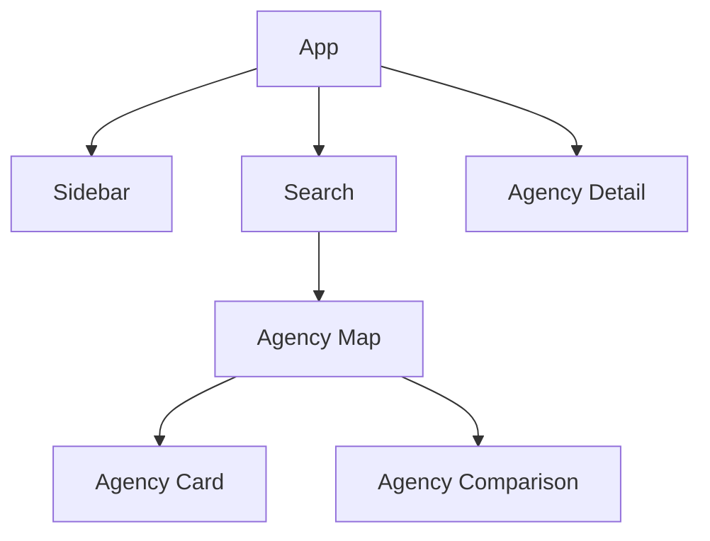

# 📚 Features - Arquitectura de Componentes

## 🎯 ¿Por qué Features?

Como mentor, quiero que entiendas que la organización por features (características) es una de las mejores prácticas en React. En lugar de agrupar por tipo de archivo (components/, hooks/, utils/), agrupamos por **dominio de negocio**.

### Ventajas de esta arquitectura:

1. **Cohesión**: Todo lo relacionado con una característica está junto
2. **Escalabilidad**: Fácil agregar nuevas features sin afectar otras
3. **Mantenibilidad**: Cambios aislados por dominio
4. **Testing**: Tests específicos por feature
5. **Colaboración**: Equipos pueden trabajar en features independientes

## 🏗️ Estructura de una Feature

```
feature-name/
├── index.ts                 # Exportaciones públicas (barrel export)
├── FeatureName.tsx          # Componente principal
├── README.md               # Documentación específica
├── components/             # Subcomponentes privados
│   ├── SubComponent1.tsx
│   └── SubComponent2.tsx
├── hooks/                  # Hooks específicos de la feature
├── utils/                  # Utilidades específicas
└── __tests__/             # Tests de la feature
```

## 📁 Features Actuales

### 1. 🗺️ [agency-map](./agency-map/README.md)
**Propósito**: Visualización interactiva de agencias en un mapa  
**Complejidad**: Alta (10+ componentes)  
**Componente Principal**: `AgencyMapOptimized`

### 2. 🎴 [agency-card](./agency-card/README.md)
**Propósito**: Tarjetas deslizables de agencias para móvil  
**Complejidad**: Media (componente único grande)  
**Componente Principal**: `AgencyCardLocationMapEnhanced`

### 3. 📊 [agency-comparison](./agency-comparison/README.md)
**Propósito**: Comparación lado a lado de múltiples agencias  
**Complejidad**: Media  
**Componente Principal**: `AgencyComparison`

### 4. 📋 [agency-detail](./agency-detail/README.md)
**Propósito**: Vista detallada con análisis de una agencia  
**Complejidad**: Media  
**Componente Principal**: `AgencyDetail`

### 5. 🔍 [search](./search/README.md)
**Propósito**: Interfaz de búsqueda con autocompletado  
**Complejidad**: Media  
**Componente Principal**: `SearchInterface`

### 6. 🧭 [sidebar](./sidebar/README.md)
**Propósito**: Navegación principal y gestión de usuario  
**Complejidad**: Media  
**Componente Principal**: `VerticalSidebar`

## 🔄 Flujo de Datos



## 💡 Mejores Prácticas

### 1. **Exports Controlados**
```typescript
// ❌ Mal - Exponer todo
export * from './components'

// ✅ Bien - Exportar solo lo público
export { FeatureName } from './FeatureName'
export type { FeatureProps } from './types'
```

### 2. **Componentes Privados**
Los componentes dentro de `components/` son privados de la feature. Si necesitas reutilizarlos, considera:
- Moverlos a `components/ui` si son genéricos
- Crear una nueva feature si es un dominio diferente

### 3. **Responsabilidad Única**
Cada feature debe tener una responsabilidad clara y única. Si crece demasiado, considera dividirla.

### 4. **Documentación**
Cada feature debe tener su README explicando:
- Propósito y contexto de negocio
- API pública (props, hooks exportados)
- Ejemplos de uso
- Decisiones de diseño importantes

## 🚀 Cómo Crear una Nueva Feature

1. **Crear estructura base**:
```bash
mkdir -p src/components/features/mi-feature/{components,hooks,utils,__tests__}
touch src/components/features/mi-feature/{index.ts,MiFeature.tsx,README.md}
```

2. **Definir exports en index.ts**:
```typescript
export { MiFeature } from './MiFeature'
export type { MiFeatureProps } from './types'
```

3. **Implementar componente principal**
4. **Documentar en README.md**
5. **Agregar tests**

## 📖 Recursos para Aprender Más

- [Feature-Sliced Design](https://feature-sliced.design/)
- [Bulletproof React](https://github.com/alan2207/bulletproof-react)
- [React Architecture Patterns](https://blog.logrocket.com/react-architecture-patterns/)

---

💡 **Consejo del Mentor**: La arquitectura por features es como organizar una biblioteca. No agrupas todos los libros rojos juntos, sino por tema. Así, cuando buscas información sobre un tema específico, todo está en el mismo lugar.