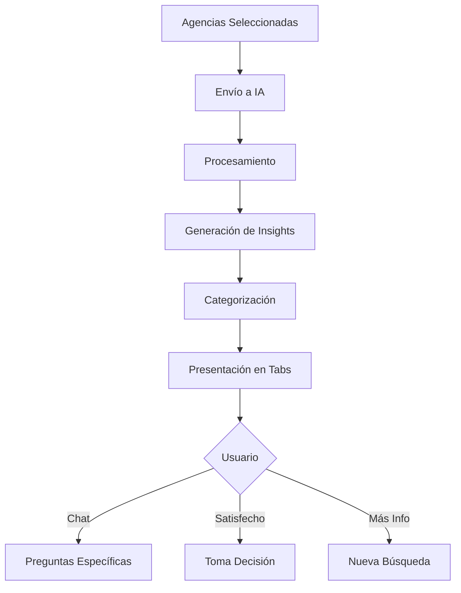

# 📋 Agency Detail - Análisis Detallado con IA

## 🎯 Propósito

Esta feature presenta el análisis profundo generado por IA de las agencias seleccionadas. Es el paso final donde el usuario obtiene insights detallados y recomendaciones personalizadas para tomar la mejor decisión.

## 🏗️ Arquitectura

```
agency-detail/
├── AgencyDetail.tsx    # 🎯 Vista de análisis con tabs
├── components/         # 📁 Listo para subcomponentes
└── index.ts           # 📤 Exportaciones
```

## 🔍 Estructura del Componente

### Props Interface

```typescript
interface AgencyDetailProps {
  agencies: Agency[]              // Agencias analizadas
  onStartNewSearch: () => void    // Reiniciar búsqueda
  onStartChat: () => void         // Abrir chat IA
}
```

### Sistema de Tabs

1. **📊 Resumen General**
   - Conclusiones principales
   - Mejor opción recomendada
   - Factores clave de decisión

2. **🏢 Análisis Individual**
   - Fortalezas de cada agencia
   - Áreas de mejora
   - Comparación con promedio

3. **💡 Recomendaciones**
   - Sugerencias personalizadas
   - Próximos pasos
   - Consideraciones adicionales

## 🎨 Componentes Visuales

### 1. **StatCard** (Métrica Individual)
```typescript
interface StatCardProps {
  icon: React.ReactNode
  label: string
  value: string | number
  trend?: 'up' | 'down' | 'neutral'
  color?: 'blue' | 'green' | 'yellow' | 'red'
}
```

**Uso**: Mostrar métricas clave como rating promedio, distancia total, etc.

### 2. **AgencyCard** (Resumen por Agencia)
```typescript
interface AgencyCardProps {
  agency: Agency & { analysis?: AnalysisData }
  rank: number
  isRecommended: boolean
}
```

**Características**:
- Badge de ranking (#1, #2, etc.)
- Indicador de recomendación
- Puntos clave del análisis
- Acciones rápidas

### 3. **InsightCard** (Hallazgo de IA)
```typescript
interface InsightCardProps {
  type: 'strength' | 'warning' | 'tip' | 'info'
  title: string
  description: string
  relatedAgencies?: string[]
}
```

## 💡 Flujo de Análisis



## 🤖 Integración con IA

### 1. **Tipos de Análisis**

```typescript
enum AnalysisType {
  COMPARATIVE = 'comparative',      // Comparación entre opciones
  INDIVIDUAL = 'individual',        // Análisis profundo de una
  RECOMMENDATION = 'recommendation' // Sugerencias personalizadas
}
```

### 2. **Estructura de Respuesta IA**

```typescript
interface AIAnalysisResponse {
  summary: {
    bestOption: string
    keyFactors: string[]
    confidence: number
  }
  individualAnalysis: {
    [agencyId: string]: {
      strengths: string[]
      weaknesses: string[]
      uniqueFeatures: string[]
      score: number
    }
  }
  recommendations: {
    primary: string
    alternatives: string[]
    considerations: string[]
  }
}
```

## 🎨 Patrones de UX

### 1. **Progressive Disclosure**
- Resumen ejecutivo primero
- Detalles en tabs secundarios
- Expandibles para más info

### 2. **Visual Hierarchy**
```
🥇 Recomendación Principal (Grande, destacada)
📊 Métricas Clave (Cards medianas)
📝 Detalles (Texto, listas)
💬 Chat CTA (Flotante)
```

### 3. **Actionable Insights**
Cada insight debe responder: "¿Y ahora qué hago con esto?"

## 🚀 Mejoras Potenciales

### 1. **Personalización del Análisis**
```typescript
interface UserPreferences {
  priorities: {
    price: number      // 0-100
    location: number   // 0-100
    reputation: number // 0-100
  }
  vehicleType: 'sedan' | 'suv' | 'truck'
  serviceNeeded: 'purchase' | 'maintenance' | 'both'
}
```

### 2. **Visualizaciones Interactivas**
- Gráfico de radar comparativo
- Timeline de reseñas
- Mapa de calor de servicios

### 3. **Exportación de Reporte**
```typescript
const exportOptions = {
  format: 'pdf' | 'email' | 'whatsapp',
  includeDetails: boolean,
  includeRecommendations: boolean
}
```

## 💡 Tips del Mentor

### 1. **Claridad sobre Completitud**
Es mejor dar 3 insights claros que 10 confusos. La IA puede generar mucho, pero filtrar es clave.

### 2. **Evitar Parálisis por Análisis**
```typescript
// Limitar información mostrada
const MAX_INSIGHTS_PER_SECTION = 5
const MAX_COMPARISON_POINTS = 3
```

### 3. **Llamadas a la Acción Claras**
Cada sección debe terminar con: "¿Qué hacer después?"

## 🐛 Consideraciones Técnicas

### 1. **Estado de Carga**
```typescript
const [analysisState, setAnalysisState] = useState<
  'idle' | 'loading' | 'success' | 'error'
>('idle')

// Mostrar esqueletos mientras carga
if (analysisState === 'loading') {
  return <AnalysisSkeleton />
}
```

### 2. **Manejo de Errores**
```typescript
// Fallback si la IA falla
const getFallbackAnalysis = (agencies: Agency[]) => {
  return {
    summary: generateBasicSummary(agencies),
    recommendation: getBestByRating(agencies)
  }
}
```

### 3. **Caché de Análisis**
```typescript
// Evitar re-análisis de las mismas agencias
const analysisCache = new Map<string, AIAnalysisResponse>()
const cacheKey = agencies.map(a => a.id).sort().join('-')
```

## 📚 Componentes por Extraer

1. **SummarySection**
   - Resumen ejecutivo
   - Métricas principales
   - Recomendación destacada

2. **ComparisonMatrix**
   - Tabla comparativa visual
   - Highlighting de ventajas
   - Ordenamiento dinámico

3. **InsightsList**
   - Lista de insights categorizados
   - Filtros por tipo
   - Búsqueda en insights

## 🎯 Métricas de Éxito

- **Tiempo a decisión**: < 2 minutos revisando
- **Tasa de chat**: < 30% (significa que el análisis fue suficiente)
- **Compartir reporte**: > 40% (valor percibido alto)

## 📖 Para Profundizar

- [Information Architecture](https://www.nngroup.com/articles/ia-vs-navigation/)
- [Data Storytelling](https://www.storytellingwithdata.com/)
- [AI UX Best Practices](https://www.nngroup.com/articles/ai-ux-guidelines/)

---

💎 **Reflexión del Mentor**: Este componente es donde la IA aporta valor real. No es solo mostrar datos, es contar una historia que lleve a una decisión. Recuerda: el usuario no quiere datos, quiere respuestas. La IA debe ser un consultor, no una base de datos.