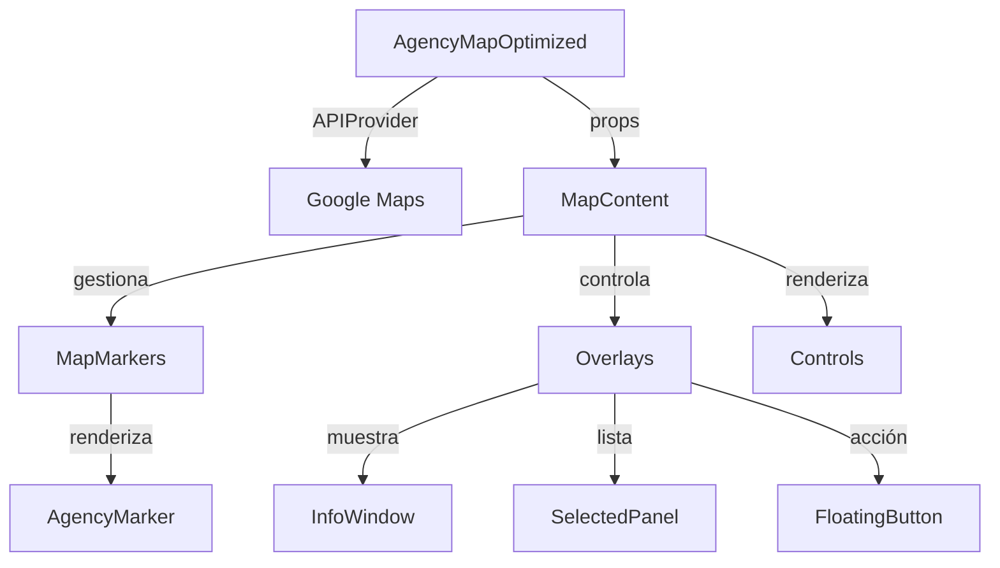

# 🗺️ Agency Map - Sistema de Visualización de Agencias

## 🎯 Propósito

Esta feature es el corazón de la aplicación. Permite a los usuarios visualizar agencias automotrices en un mapa interactivo, seleccionarlas para comparación y análisis, y navegar entre ellas de manera intuitiva.

## 🏗️ Arquitectura de Componentes

```
agency-map/
├── AgencyMapOptimized.tsx    # 🎯 Componente principal (orquestador)
├── components/
│   ├── MapContent.tsx        # 🧠 Lógica principal y estado del mapa
│   ├── Controls/
│   │   └── MapControlsOverlay.tsx  # 🎮 Controles superiores del mapa
│   ├── Markers/
│   │   ├── AgencyMarker.tsx        # 📍 Marcador individual de agencia
│   │   └── MapMarkers.tsx          # 🗺️ Gestor de todos los marcadores
│   └── Overlays/
│       ├── AgencyInfoWindow.tsx    # 💬 Ventana de información al hacer clic
│       ├── SelectedAgenciesPanel.tsx # 📋 Panel de agencias seleccionadas
│       └── FloatingAnalysisButton.tsx # 🔘 Botón flotante de análisis
└── utils/
    └── constants.ts          # 🎨 Estilos del mapa y constantes
```

## 🔄 Flujo de Datos



## 📚 Documentación de Componentes

### 1. **AgencyMapOptimized** (Componente Principal)

**Responsabilidad**: Orquestador principal que configura el contexto de Google Maps y calcula el centro inicial del mapa.

```typescript
interface AgencyMapOptimizedProps {
  agencies: Agency[]              // Lista de agencias a mostrar
  searchLocation?: Coordinates    // Ubicación de búsqueda del usuario
  selectedAgencies: string[]      // IDs de agencias seleccionadas
  onAgencySelect: (id: string) => void    // Callback al seleccionar
  onStartAnalysis: () => void     // Callback para iniciar análisis
  isLoading?: boolean             // Estado de carga
}
```

**Lección del Mentor**: Este componente sigue el principio de "composición sobre herencia". En lugar de tener un mega-componente, delega responsabilidades a MapContent.

### 2. **MapContent** (Cerebro del Mapa)

**Responsabilidad**: Gestiona todo el estado interno del mapa y coordina la interacción entre subcomponentes.

**Estados que maneja**:
- `selectedInfoWindow`: Qué ventana de info está abierta
- `showMobileCard`: Si mostrar la tarjeta móvil
- `isMobile`: Detección de dispositivo
- `showComparison`: Modal de comparación

**Funciones clave**:
- `handleMarkerClick`: Lógica diferente para móvil vs desktop
- `fitBounds`: Ajusta el zoom para mostrar todas las agencias
- `handleGetDirections`: Abre Google Maps con direcciones

**Lección del Mentor**: Este componente implementa el patrón "Smart vs Dumb Components". Es "smart" porque maneja estado y lógica, mientras que sus hijos son mayormente "dumb" (presentacionales).

### 3. **Componentes de Markers/**

#### **MapMarkers**
- **Qué hace**: Renderiza todos los marcadores en el mapa
- **Incluye**: Marcador de ubicación del usuario + marcadores de agencias
- **Preparado para**: Clustering (agrupación) cuando haya muchos marcadores

#### **AgencyMarker**
- **Qué hace**: Representa visualmente una agencia en el mapa
- **Estados visuales**:
  - Normal: Blanco con ícono de pin
  - Seleccionado: Color primario con anillo y check verde
  - Hover: Escala 1.1x
- **Usa**: Framer Motion para animaciones suaves

**Lección del Mentor**: Los marcadores usan `AdvancedMarker` de Google Maps que permite HTML/React personalizado, no solo íconos.

### 4. **Componentes de Overlays/**

#### **AgencyInfoWindow**
- **Cuándo aparece**: Al hacer clic en un marcador (solo desktop)
- **Muestra**: Nombre, rating, dirección, teléfono, sitio web, horario
- **Acción principal**: Botón para seleccionar/deseleccionar

#### **SelectedAgenciesPanel**
- **Dónde**: Esquina inferior derecha (desktop) o bottom completo (móvil)
- **Qué muestra**: Lista de agencias seleccionadas
- **Características**:
  - Expandible/colapsable
  - Botón de comparación (2+ agencias)
  - Eliminación individual

#### **FloatingAnalysisButton**
- **Posición**: Centro inferior
- **Cuándo aparece**: Cuando hay agencias seleccionadas
- **Animación**: Scale in/out con Framer Motion

### 5. **Controls/**

#### **MapControlsOverlay**
- **Posición**: Top de la pantalla
- **Izquierda**: Contador de agencias encontradas
- **Derecha**: Instrucciones de uso
- **Animaciones**: Slide in desde los lados

### 6. **Utils/constants.ts**

Contiene:
- **MAP_STYLES**: Estilos personalizados para el mapa (light/dark)
- **DEFAULT_CENTER**: Centro por defecto (CDMX)
- **ZOOM_LEVELS**: Niveles de zoom mín/máx

## 🎨 Patrones de Diseño Utilizados

1. **Container/Presentational Pattern**
   - `MapContent` = Container (lógica)
   - `AgencyMarker`, `InfoWindow` = Presentational

2. **Compound Components**
   - Aunque no está implementado, la estructura está lista para ello

3. **Render Props** (implícito)
   - Google Maps components usan este patrón internamente

4. **Observer Pattern**
   - Los markers observan cambios en `selectedAgencies`

## 🚀 Cómo Extender esta Feature

### Agregar un nuevo tipo de marcador:
1. Crear componente en `Markers/`
2. Agregar lógica de renderizado en `MapMarkers`
3. Actualizar tipos si es necesario

### Agregar un nuevo overlay:
1. Crear componente en `Overlays/`
2. Importar y usar en `MapContent`
3. Gestionar su estado en `MapContent`

### Personalizar estilos del mapa:
1. Modificar `MAP_STYLES` en `constants.ts`
2. Usar [Google Maps Styling Wizard](https://mapstyle.withgoogle.com/)

## 💡 Tips del Mentor

1. **Performance**: El mapa re-renderiza mucho. Usa `React.memo` en componentes que no cambian frecuentemente.

2. **UX Móvil vs Desktop**: Nota cómo `handleMarkerClick` tiene lógica diferente. En móvil abre una tarjeta, en desktop una info window.

3. **Bounds y Zoom**: El código previene "over-zoom" (zoom > 16) para mantener contexto visual.

4. **Animaciones**: Framer Motion se usa estratégicamente solo donde añade valor (no en todo).

## 🐛 Problemas Conocidos y Soluciones

1. **Clustering no implementado**: El código está preparado pero comentado. Google Maps Marker Clusterer necesita adaptación para `@vis.gl/react-google-maps`.

2. **Re-renders excesivos**: Considera implementar `useMemo` para `bounds` calculation.

## 📖 Para Aprender Más

- [Google Maps React Documentation](https://visgl.github.io/react-google-maps/)
- [Framer Motion Best Practices](https://www.framer.com/motion/)
- [React Performance Optimization](https://react.dev/learn/render-and-commit)

---

💎 **Reflexión Final del Mentor**: Este componente es un excelente ejemplo de cómo descomponer complejidad. En lugar de un archivo de 1000+ líneas, tenemos componentes especializados de 50-200 líneas cada uno. Recuerda: "El mejor código es el que puedes entender 6 meses después."