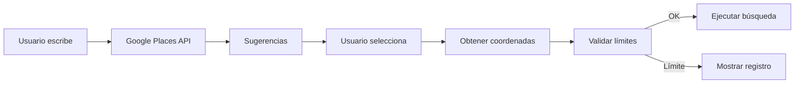

# 🔍 Search - Interfaz de Búsqueda Inteligente

## 🎯 Propósito

Esta feature es el punto de entrada principal de la aplicación. Permite a los usuarios buscar agencias automotrices por ubicación con autocompletado inteligente de Google Places, mostrando límites de búsqueda para usuarios no autenticados.

## 🏗️ Arquitectura

```
search/
├── SearchInterface.tsx    # 🎯 Componente principal de búsqueda
├── components/           # 📁 Subcomponentes (por implementar)
└── index.ts             # 📤 Exportaciones
```

## 🔍 Anatomía del Componente

### Props Interface

```typescript
interface SearchInterfaceProps {
  onSearch: (data: SearchData) => void
  isLoading?: boolean
  className?: string
}

interface SearchData {
  location: string      // Texto de ubicación
  query?: string       // Búsqueda adicional (opcional)
  placeId?: string     // Google Place ID
  placeDetails?: {     // Detalles de Google Places
    description: string
    mainText: string
    secondaryText: string
  }
  coordinates?: {
    lat: number
    lng: number
  }
}
```

## 🌟 Características Principales

### 1. **Autocompletado Inteligente**
- Integración con Google Places Autocomplete
- Sugerencias en tiempo real
- Sesión token para optimizar costos API

### 2. **Límite de Búsquedas**
- Indicador visual para usuarios no autenticados
- 5 búsquedas gratuitas por sesión
- Componente `SearchLimitIndicator`

### 3. **Validación y UX**
- Validación de ubicación requerida
- Estados de carga
- Mensajes de error contextuales
- Diseño responsive

## 🔄 Flujo de Búsqueda



## 💡 Componentes Internos

### 1. **LocationAutocomplete** (Importado)
```typescript
<LocationAutocomplete
  onPlaceSelect={handlePlaceSelect}
  placeholder="¿Dónde buscas agencias?"
  className={cn("w-full", { "error": hasError })}
/>
```

**Características**:
- Debouncing de 300ms
- Filtrado por país (MX)
- Manejo de sesión token

### 2. **SearchLimitIndicator** (Importado)
```typescript
<SearchLimitIndicator />
// Muestra: "3 de 5 búsquedas restantes"
```

**Lógica**:
- Hook `useSearchLimit`
- LocalStorage para persistencia
- Reset cada 24 horas

### 3. **SearchButton** (Interno)
```typescript
<Button 
  type="submit" 
  disabled={!location || isLoading}
  className="w-full"
>
  {isLoading ? <Spinner /> : 'Buscar agencias'}
</Button>
```

## 🎨 Estados Visuales

### 1. **Estado Inicial**
```
┌─────────────────────────────────────┐
│ 🔍 ¿Dónde buscas agencias?         │
│     Ciudad, colonia o dirección...  │
├─────────────────────────────────────┤
│ 🏷️ Tipo de servicio (opcional)     │
│     Ej: "servicio premium"          │
├─────────────────────────────────────┤
│        [Buscar agencias]            │
└─────────────────────────────────────┘
```

### 2. **Con Autocompletado**
```
┌─────────────────────────────────────┐
│ 🔍 Polanco                          │
├─────────────────────────────────────┤
│ 📍 Polanco, CDMX                    │
│ 📍 Polanco, Miguel Hidalgo          │
│ 📍 Av. Presidente Masaryk, Polanco  │
└─────────────────────────────────────┘
```

### 3. **Con Límite (Usuario no autenticado)**
```
┌─────────────────────────────────────┐
│ ⚡ 2 de 5 búsquedas restantes       │
├─────────────────────────────────────┤
│ 🔍 ¿Dónde buscas agencias?         │
│ ...                                 │
```

## 🚀 Mejoras Potenciales

### 1. **Búsquedas Recientes**
```typescript
const [recentSearches, setRecentSearches] = useLocalStorage<SearchData[]>(
  'recent-searches', 
  []
)

// Mostrar cuando el input está vacío
<RecentSearches 
  searches={recentSearches}
  onSelect={handleRecentSelect}
/>
```

### 2. **Búsquedas Guardadas**
```typescript
interface SavedSearch {
  id: string
  name: string
  searchData: SearchData
  createdAt: Date
}

// Para usuarios autenticados
<SavedSearches userId={user.id} />
```

### 3. **Filtros Avanzados**
```typescript
<AdvancedFilters>
  <ServiceTypeFilter />
  <RatingFilter min={4} />
  <DistanceFilter max={10} unit="km" />
  <HoursFilter openNow={true} />
</AdvancedFilters>
```

## 💡 Tips del Mentor

### 1. **Optimización de API**
Google Places cobra por sesión. Usa el mismo token durante toda la interacción:
```typescript
const sessionToken = useMemo(
  () => new google.maps.places.AutocompleteSessionToken(),
  []
)
```

### 2. **Debouncing Inteligente**
300ms es el sweet spot. Menos = muchas llamadas. Más = se siente lento.

### 3. **Fallbacks**
Si Google Places falla, considera:
- Cache de búsquedas populares
- Búsqueda por texto libre
- Sugerencias predefinidas

## 🐛 Consideraciones Técnicas

### 1. **Manejo de Errores**
```typescript
try {
  const details = await getPlaceDetails(placeId)
} catch (error) {
  if (error.code === 'QUOTA_EXCEEDED') {
    showError('Servicio temporalmente no disponible')
    // Fallback a búsqueda por texto
  }
}
```

### 2. **Validación de Coordenadas**
```typescript
const isValidMexicoLocation = (lat: number, lng: number) => {
  // Bounding box aproximado de México
  return lat >= 14.5 && lat <= 32.7 && 
         lng >= -118.4 && lng <= -86.7
}
```

### 3. **Performance**
```typescript
// Memoizar componentes pesados
const MemoizedAutocomplete = React.memo(LocationAutocomplete)

// Evitar re-renders innecesarios
const handleSearch = useCallback((data) => {
  onSearch(data)
}, [onSearch])
```

## 📚 Componentes a Extraer

1. **SearchForm**
   - Lógica del formulario
   - Validación
   - Submit handling

2. **SearchFilters**
   - Filtros colapsables
   - Estado de filtros
   - Badges de filtros activos

3. **SearchHistory**
   - Búsquedas recientes
   - Búsquedas populares
   - Gestión de favoritos

## 🎯 Métricas de Éxito

- **Tiempo a primera búsqueda**: < 10 segundos
- **Tasa de completado**: > 80%
- **Uso de autocompletado**: > 90%
- **Búsquedas fallidas**: < 5%

## 📖 Recursos

- [Google Places Autocomplete](https://developers.google.com/maps/documentation/javascript/place-autocomplete)
- [Search UX Best Practices](https://www.nngroup.com/articles/search-visible-and-simple/)
- [Form Design Patterns](https://www.smashingmagazine.com/2018/08/best-practices-for-mobile-form-design/)

---

💎 **Reflexión del Mentor**: La búsqueda es la puerta de entrada. Si falla aquí, perdemos al usuario. Hazla obvia, rápida y tolerante a errores. Recuerda: el usuario no sabe exactamente qué busca hasta que lo ve en las sugerencias. El autocompletado no es solo una conveniencia, es una herramienta de descubrimiento.