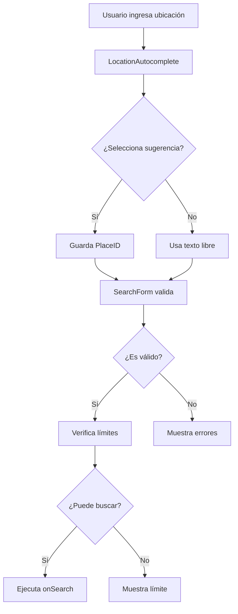

# 🔍 Search Feature - Sistema de Búsqueda Inteligente

## 🎯 Propósito

El componente de búsqueda es la puerta de entrada a la aplicación, permitiendo a los usuarios buscar agencias automotrices por ubicación con opciones de filtrado avanzado.

## 🏗️ Arquitectura

```
search/
├── SearchInterface.tsx          # Componente principal orquestador
├── components/                  # Subcomponentes modulares
│   ├── LocationAutocomplete/   # Campo con autocompletado de Google Places
│   ├── SearchForm/             # Formulario principal con validación
│   └── SearchLimitIndicator/   # Indicador visual de límites
├── hooks/                      # Lógica de estado
│   └── useSearchLimit.ts       # Gestión de límites de búsqueda
├── utils/                      # Utilidades
│   ├── validation.ts           # Schemas de validación con Zod
│   └── constants.ts            # Constantes y configuración
└── types/                      # Tipos específicos (si fuera necesario)
```

## 🎨 Componentes

### SearchInterface
**Componente principal** que orquesta toda la funcionalidad de búsqueda.

```tsx
<SearchInterface 
  onSearch={handleSearch}
  isLoading={searchInProgress}
/>
```

**Props:**
- `onSearch: (data: SearchData) => void` - Callback con los datos de búsqueda
- `isLoading?: boolean` - Estado de carga

### LocationAutocomplete
**Campo inteligente** con autocompletado de Google Places.

**Características:**
- Autocompletado con debounce de 300ms
- Detección de ubicación actual con privacidad
- Navegación por teclado (flechas, enter, escape)
- Limpieza de campo con un clic

### SearchForm
**Formulario estructurado** con validación robusta.

**Campos:**
- Ubicación (requerido)
- Query de búsqueda (opcional)

**Validación:**
- Schema con Zod
- Mensajes de error en español
- Estados de campo dinámicos

### SearchLimitIndicator
**Indicador visual** del límite de búsquedas gratuitas.

**Estados:**
- Normal: Muestra búsquedas restantes con barra de progreso
- Límite alcanzado: Animación y mensaje de advertencia
- Oculto: Para usuarios autenticados

## 🔧 Hooks Personalizados

### useSearchLimit
Hook para gestionar límites de búsqueda y autenticación.

```typescript
const { 
  remaining,      // Búsquedas restantes
  total,          // Total permitido
  canSearch,      // ¿Puede buscar?
  isAuthenticated,// ¿Está autenticado?
  refreshLimit    // Función para actualizar
} = useSearchLimit()
```

## 💡 Patrones de Diseño

### 1. **Composición sobre Herencia**
```tsx
// SearchInterface compone múltiples componentes especializados
<SearchInterface>
  <SearchForm>
    <LocationAutocomplete />
    <SearchButton />
  </SearchForm>
  <SearchLimitIndicator />
</SearchInterface>
```

### 2. **Separation of Concerns**
- **SearchInterface**: Orquestación
- **SearchForm**: Lógica de formulario
- **LocationAutocomplete**: Integración con Google
- **useSearchLimit**: Estado de límites

### 3. **Controlled Components**
Todos los inputs son controlados por React Hook Form para mejor performance.

### 4. **Error Boundaries**
Manejo de errores en cada nivel:
- Validación de formulario
- Errores de API
- Fallbacks de ubicación

## 🚀 Flujo de Datos



## 🎯 Mejores Prácticas

### 1. **Performance**
- Debounce en autocompletado (300ms)
- Memoización de componentes pesados
- Lazy loading de Google Maps

### 2. **UX/Accesibilidad**
- Navegación completa por teclado
- Mensajes de error claros
- Estados de carga visuales
- Indicadores de límite prominentes

### 3. **Seguridad/Privacidad**
- No muestra dirección exacta en ubicación actual
- Usa barrios/zonas generales
- Session tokens para Google Places

### 4. **Internacionalización**
- Textos centralizados en constants.ts
- Fácil traducción futura
- Formatos de fecha/hora localizados

## 🔍 Testing

```typescript
// Ejemplo de test para SearchForm
describe('SearchForm', () => {
  it('should validate location is required', async () => {
    const { getByRole } = render(<SearchForm {...props} />)
    
    fireEvent.submit(getByRole('form'))
    
    await waitFor(() => {
      expect(screen.getByText('La ubicación es requerida')).toBeInTheDocument()
    })
  })
})
```

## 📈 Métricas y Analytics

El componente trackea:
- Inicios de búsqueda
- Tipo de ubicación (autocompletado vs manual)
- Uso de ubicación actual
- Límites alcanzados

## 🚧 Consideraciones Técnicas

### Google Places API
- Requiere API key en variable de entorno
- Límites de quota mensual
- Session tokens para optimizar costos

### Estado Global
- Límites de búsqueda en hook local
- Posible migración a contexto si crece

### Optimizaciones Futuras
- [ ] Cache de búsquedas recientes
- [ ] Sugerencias basadas en historial
- [ ] Búsqueda por voz
- [ ] Filtros avanzados inline

---

💡 **Nota del Arquitecto**: Este componente sigue el principio de "Progressive Disclosure" - muestra solo lo necesario inicialmente (campo de ubicación) y revela opciones avanzadas (query) de forma secundaria. Esto reduce la carga cognitiva y mejora la conversión.