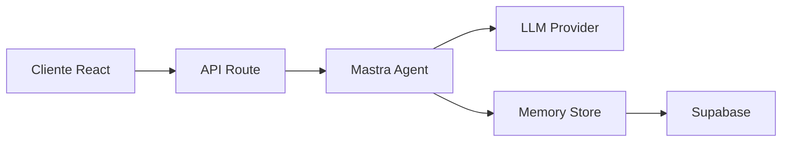

# 🤖 Mastra AI Integration para Karmatic

Este módulo implementa el sistema de agentes AI para Karmatic usando el framework Mastra.

## 📋 Índice

- [Instalación](#instalación)
- [Configuración](#configuración)
- [Arquitectura](#arquitectura)
- [Uso](#uso)
- [Proveedores LLM](#proveedores-llm)
- [API Reference](#api-reference)
- [Desarrollo](#desarrollo)

## 🚀 Instalación

Las dependencias ya están instaladas en el proyecto principal. Si necesitas reinstalar:

```bash
pnpm add @mastra/core @mastra/memory @ai-sdk/openai @ai-sdk/anthropic @ai-sdk/google @ai-sdk/mistral @ai-sdk/cohere @ai-sdk/amazon-bedrock ai zod
```

## ⚙️ Configuración

### Variables de Entorno

Configura tus API keys en `.env.local`:

```bash
# Requerido: Elige al menos un proveedor
OPENAI_API_KEY=sk-...
ANTHROPIC_API_KEY=sk-ant-...
GOOGLE_GENERATIVE_AI_API_KEY=...
MISTRAL_API_KEY=...
COHERE_API_KEY=...

# Para Amazon Bedrock
AWS_ACCESS_KEY_ID=...
AWS_SECRET_ACCESS_KEY=...
AWS_REGION=us-east-1

# Configuración
DEFAULT_LLM_PROVIDER=openai  # Opciones: openai, anthropic, google, mistral, cohere, bedrock
MASTRA_LOG_LEVEL=info
```

### Next.js Config

El archivo `next.config.ts` ya está configurado con:

```typescript
{
  serverExternalPackages: ["@mastra/*", "@mastra/core"]
}
```

## 🏗️ Arquitectura

```
src/mastra/
├── agents/          # Definiciones de agentes AI
│   └── karmatic-assistant.ts
├── config/          # Configuraciones y utilidades
│   ├── llm-providers.ts
│   └── memory-store.ts
├── tools/           # Herramientas personalizadas (8 tools)
│   ├── search-dealerships.ts
│   ├── analyze-dealership.ts
│   ├── get-vehicle-inventory.ts
│   ├── get-market-insights.ts
│   ├── compare-vehicles.ts
│   ├── save-user-preference.ts
│   ├── get-search-history.ts
│   └── generate-recommendations.ts
├── workflows/       # Flujos de trabajo multi-agente (3 workflows)
│   ├── vehicle-search-workflow.ts
│   ├── dealership-analysis-workflow.ts
│   └── recommendation-workflow.ts
├── analytics/       # Sistema de métricas y analytics
│   ├── metrics-collector.ts
│   ├── performance-analyzer.ts
│   └── types.ts
├── mcp/            # Integración MCP completa
│   └── index.ts
└── index.ts        # Punto de entrada principal
```

### Flujo de Datos



## 💻 Uso

### Uso Básico

```typescript
import { mastra } from '@/src/mastra';

// Obtener un agente
const agent = mastra.getAgent('karmaticAssistant');

// Generar respuesta
const response = await agent.generate('¿Cómo puedo ayudarte?');

// Streaming
const stream = await agent.stream(messages);
return stream.toDataStreamResponse();
```

### En API Routes

```typescript
// app/api/ai/chat/route.ts
import { mastra } from '@/src/mastra';

export async function POST(req: Request) {
  const { messages } = await req.json();
  const agent = mastra.getAgent('karmaticAssistant');
  const stream = await agent.stream(messages);
  
  return stream.toDataStreamResponse();
}
```

### Crear Agente con Modelo Específico

```typescript
import { createKarmaticAssistant } from '@/src/mastra/agents/karmatic-assistant';

// Usar GPT-4o en lugar del modelo default
const agent = createKarmaticAssistant('gpt-4o');

// Usar Claude
const claudeAgent = createKarmaticAssistant('claude-3-5-sonnet');
```

## 🤖 Proveedores LLM

### Modelos Disponibles

| Proveedor | Modelo | ID | Descripción | Costo (1K tokens) |
|-----------|--------|----|--------------|--------------------|
| **OpenAI** | GPT-4o | `gpt-4o` | Más capaz, multimodal | $0.005/$0.015 |
| | GPT-4o Mini | `gpt-4o-mini` | Rápido y económico | $0.00015/$0.0006 |
| | GPT-4 Turbo | `gpt-4-turbo` | Con capacidad de visión | $0.01/$0.03 |
| **Anthropic** | Claude 3.5 Sonnet | `claude-3-5-sonnet` | Más inteligente | $0.003/$0.015 |
| | Claude 3.5 Haiku | `claude-3-5-haiku` | Rápido y eficiente | $0.001/$0.005 |
| | Claude 3 Opus | `claude-3-opus` | Para tareas complejas | $0.015/$0.075 |
| **Google** | Gemini 2.0 Flash | `gemini-2.0-flash` | Multimodal rápido | $0.00025/$0.001 |
| | Gemini 1.5 Pro | `gemini-1.5-pro` | Capacidades avanzadas | $0.00125/$0.005 |
| **Mistral** | Mistral Large | `mistral-large` | Modelo premium | $0.003/$0.009 |
| | Mistral Small | `mistral-small` | Eficiente en costo | $0.001/$0.003 |
| **Cohere** | Command R+ | `command-r-plus` | Avanzado para RAG | $0.003/$0.015 |
| | Command R | `command-r` | Eficiente para chat | $0.0005/$0.0015 |
| **Bedrock** | Claude 3 Sonnet | `claude-3-sonnet-bedrock` | Via AWS | $0.003/$0.015 |
| | Llama 3 70B | `llama-3-70b-bedrock` | Via AWS | $0.00265/$0.0035 |

### Verificar Proveedores Configurados

```typescript
import { getConfiguredProviders, isProviderConfigured } from '@/src/mastra/config/llm-providers';

// Listar proveedores activos
const providers = getConfiguredProviders();
console.log('Proveedores configurados:', providers);
// Output: ['openai', 'anthropic']

// Verificar proveedor específico
if (isProviderConfigured('openai')) {
  // Usar modelos de OpenAI
}
```

## 📚 API Reference

### `llm-providers.ts`

#### `getModel(modelName: string): LanguageModelV1`
Obtiene una instancia de modelo por nombre.

```typescript
const model = getModel('gpt-4o-mini');
```

#### `getDefaultModel(): LanguageModelV1`
Obtiene el modelo predeterminado según `DEFAULT_LLM_PROVIDER`.

```typescript
const model = getDefaultModel();
```

#### `isProviderConfigured(provider: LLMProvider): boolean`
Verifica si un proveedor tiene API key configurada.

```typescript
if (isProviderConfigured('openai')) {
  // OpenAI está disponible
}
```

#### `getConfiguredProviders(): LLMProvider[]`
Lista todos los proveedores con API key configurada.

```typescript
const providers = getConfiguredProviders();
// ['openai', 'anthropic', 'google']
```

#### `getAvailableModels(): ModelConfig[]`
Lista modelos disponibles solo de proveedores configurados.

```typescript
const models = getAvailableModels();
// Solo modelos de proveedores con API key
```

## 🛠️ Desarrollo

### Agregar un Nuevo Agente

1. Crea un archivo en `src/mastra/agents/`:

```typescript
// src/mastra/agents/mi-agente.ts
import { Agent } from "@mastra/core/agent";
import { getDefaultModel } from "../config/llm-providers";

export const miAgente = new Agent({
  name: "Mi Agente",
  instructions: "Instrucciones del agente...",
  model: getDefaultModel(),
  temperature: 0.7,
});
```

2. Regístralo en `src/mastra/index.ts`:

```typescript
import { miAgente } from "./agents/mi-agente";

export const mastra = new Mastra({
  agents: { 
    karmaticAssistant,
    miAgente // Nuevo agente
  }
});
```

### Agregar una Herramienta

```typescript
// src/mastra/tools/mi-herramienta.ts
import { createTool } from "@mastra/core/tools";
import { z } from "zod";

export const miHerramienta = createTool({
  id: "mi-herramienta",
  description: "Descripción de la herramienta",
  inputSchema: z.object({
    parametro: z.string()
  }),
  execute: async ({ parametro }) => {
    // Lógica de la herramienta
    return { resultado: "..." };
  }
});
```

### Testing

```bash
# Verificar tipos
pnpm tsc --noEmit

# Ejecutar servidor de desarrollo
pnpm dev
```

## 🚦 Estado del Proyecto

### Phase 1 - Completada ✅
- ✅ Configuración multi-LLM
- ✅ Estructura base
- ✅ Agente básico (karmaticAssistant)
- ✅ Integración con API routes
- ✅ Streaming de respuestas
- ✅ Manejo de contexto de búsqueda
- ✅ Tests de integración

### Phase 2 - Completada ✅
- ✅ **Memory store con Supabase**: Memoria persistente con semantic recall y working memory
- ✅ **Herramientas personalizadas**: 8 tools especializados para búsqueda automotriz
- ✅ **Workflows multi-agente**: 3 workflows orchestados con agentes especializados
- ✅ **Analytics y métricas**: Sistema completo de tracking y performance monitoring
- ✅ **Integración MCP**: Soporte para todos los MCP servers disponibles

#### 🔧 Herramientas Implementadas (8 tools)
1. **searchDealerships** - Búsqueda avanzada de concesionarios
2. **analyzeDealership** - Análisis detallado de concesionarios individuales
3. **getVehicleInventory** - Consulta de inventario disponible
4. **getMarketInsights** - Insights del mercado local y tendencias
5. **compareVehicles** - Comparación detallada entre vehículos
6. **saveUserPreference** - Gestión de preferencias del usuario
7. **getSearchHistory** - Acceso al historial de búsquedas
8. **generateRecommendations** - Recomendaciones personalizadas

#### 🔄 Workflows Multi-Agente (3 workflows)
1. **vehicleSearchWorkflow** - Búsqueda integral con múltiples agentes especializados
2. **dealershipAnalysisWorkflow** - Análisis comprehensive de concesionarios
3. **recommendationWorkflow** - Motor de recomendaciones personalizado

#### 📊 Sistema de Analytics
- **Metrics Collector** - Recolección de métricas de AI (tokens, costos, performance)
- **Performance Analyzer** - Monitoreo de rendimiento en tiempo real
- **User Interaction Tracker** - Seguimiento de interacciones y satisfacción
- **System Health Monitor** - Monitoreo de salud del sistema

#### 🔌 Integración MCP
- **Perplexity Research** - Investigación web en tiempo real
- **Context7 Documentation** - Lookup de documentación técnica
- **Playwright Automation** - Automatización de browser para datos en vivo
- **Supabase Advanced** - Operaciones avanzadas de base de datos

## 📞 Soporte

Para problemas o preguntas sobre este módulo, revisar:

1. [Documentación de Mastra](https://mastra.ai/docs)
2. [Vercel AI SDK](https://sdk.vercel.ai/docs)
3. Código fuente en `src/mastra/`

---

**Última actualización**: Julio 2025  
**Versión**: 1.0.0