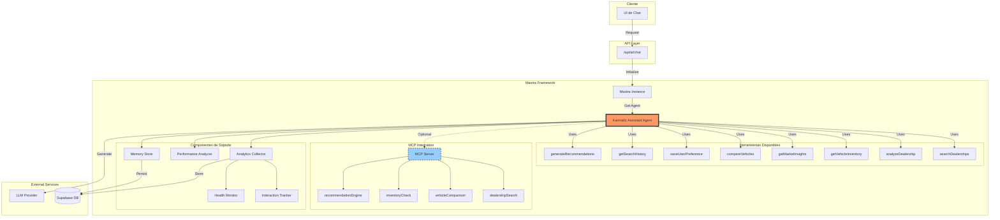

# Arquitectura de Herramientas y Agente Karmatic



## Descripción de Componentes

### 1. **Cliente (UI)**
- Interfaz de chat donde los usuarios interactúan con el sistema

### 2. **API Layer**
- `/api/ai/chat`: Endpoint que recibe las solicitudes y las enruta al agente

### 3. **Mastra Framework**
- **Mastra Instance**: Instancia principal que gestiona agentes, herramientas y memoria
- **Karmatic Assistant Agent**: Agente principal que orquesta las respuestas

### 4. **Herramientas Nativas**
Las herramientas se conectan directamente al agente a través del sistema de herramientas de Mastra:

- **searchDealerships**: Busca concesionarios por ubicación y criterios
- **analyzeDealership**: Analiza información detallada de un concesionario
- **getVehicleInventory**: Obtiene inventario de vehículos disponibles
- **getMarketInsights**: Proporciona análisis del mercado
- **compareVehicles**: Compara múltiples vehículos
- **saveUserPreference**: Guarda preferencias del usuario
- **getSearchHistory**: Recupera historial de búsquedas
- **generateRecommendations**: Genera recomendaciones personalizadas

### 5. **MCP Integration (Opcional)**
- Proporciona herramientas adicionales a través del Model Context Protocol
- Las herramientas MCP se mapean a las herramientas nativas cuando están habilitadas

### 6. **Componentes de Soporte**
- **Memory Store**: Almacena contexto y conversaciones
- **Analytics Collector**: Recopila métricas de uso
- **Performance Analyzer**: Monitorea el rendimiento
- **Interaction Tracker**: Rastrea interacciones del usuario
- **Health Monitor**: Verifica la salud del sistema

### 7. **Servicios Externos**
- **Supabase DB**: Base de datos para persistencia
- **LLM Provider**: Modelo de lenguaje para generar respuestas

## Flujo de Conexión

1. **Inicialización**:
   ```typescript
   const mastra = new Mastra({
     agents: { karmaticAssistant },
     tools: karmaticTools,
     memory: memoryStore
   });
   ```

2. **Registro de Herramientas**:
   ```typescript
   const agent = new Agent({
     name: "Karmatic Assistant",
     tools: {
       searchDealerships,
       analyzeDealership,
       // ... otras herramientas
     }
   });
   ```

3. **Ejecución**:
   - El agente recibe un mensaje
   - Determina qué herramientas usar basándose en el contexto
   - Ejecuta las herramientas con los parámetros extraídos
   - Las herramientas acceden a servicios externos si es necesario
   - Los resultados se procesan y se devuelven al usuario

4. **MCP Integration** (cuando está habilitada):
   - Las herramientas MCP se traducen a llamadas de herramientas nativas
   - Proporciona una interfaz alternativa para las mismas funcionalidades